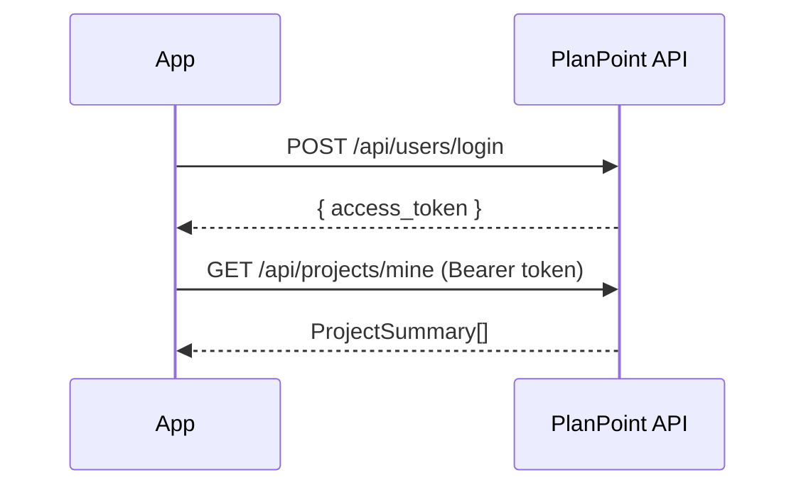

## Overview

The Planpoint SDK gives developers programmatic access to the Planpoint platform — the same data that powers the interactive floor plan viewer on your website.

Use it to build custom dashboards, automate unit management, sync availability with your CRM, or embed project data into any application.

## What You Can Do

<CardGroup cols={2}>
  <Card title="Authenticate" icon="key">
    Log in with your Planpoint credentials and receive a JWT token to make authenticated requests.
  </Card>

  <Card title="Manage Projects" icon="building">
    List your projects, retrieve full project details including floors, units, and display settings.
  </Card>

  <Card title="Manage Units" icon="table-cells">
    Create, update, delete, and batch-update units. Control status, pricing, bedrooms, and more.
  </Card>

  <Card title="Manage Floors" icon="layer-group">
    Create and update floor plans, set display order, and attach SVG paths or images.
  </Card>

  <Card title="Manage Groups" icon="folder-tree">
    Organize multiple projects under groups. Control team access with owner, admin, and editor roles.
  </Card>

  <Card title="Access Leads" icon="users">
    Retrieve leads submitted through your project's contact forms, including contact details and unit interest.
  </Card>
</CardGroup>

## Core Concepts

### Authentication

All requests (except `findProject`) require a Bearer token. Obtain one by calling `login` with your Planpoint credentials. The token is a JWT and should be passed in the `Authorization` header of every subsequent request.

### Projects

A **Project** is the top-level entity. It contains floors, units, branding settings, and display configuration. Projects are identified by an `_id` (ObjectId) and a `namespace` (URL-friendly slug).

### Floors & Units

**Floors** are ordered levels within a project. Each floor contains **Units** — the individual listings with attributes like status, price, bedrooms, bathrooms, and square footage.

Unit status can be one of: `Available`, `OnHold`, `Sold`, `Leased`, or `Unavailable`.

### Groups

**Groups** allow you to organize multiple projects under a single entity (e.g. a development company). Groups support role-based access: `owner`, `admin`, and `editor`.

### Leads

**Leads** are contact form submissions captured through the PlanPoint embed. Each lead includes name, email, phone, message, and the unit of interest.

## Available SDKs

<CardGroup cols={2}>
  <Card title="TypeScript / JavaScript" icon="js" href="https://viewerdocs.planpoint.io/sdk-documentation/java-script">
    Install via npm. Works in Node.js and browser environments.

    ```bash
    npm install @planpoint/sdk
    ```
  </Card>

  <Card title="Python" icon="python" href="https://viewerdocs.planpoint.io/sdk-documentation/untitled-page">
    Install via pip. Works with Python 3.8\+.

    ```bash
    pip install planpoint-sdk
    ```
  </Card>
</CardGroup>

## Base URL

All API requests are made to:

```text
https://app.planpoint.io
```

## Authentication Flow

